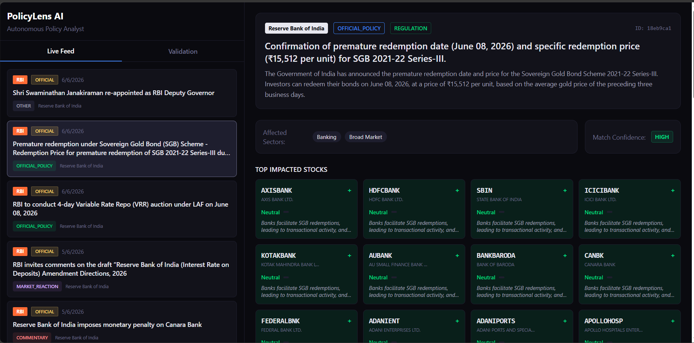

# PolicyLens AI

## Overview
PolicyLens AI is a full-stack policy intelligence platform that tracks Indian policy and regulatory updates, analyzes their likely market impact, and surfaces the most affected sectors and stocks through an interactive dashboard. The app is designed to help users quickly move from a raw policy announcement to a structured market-impact view.

## Problem Statement
Policy announcements from sources like RBI, SEBI, and government press releases can move markets quickly, but investors and analysts often have to manually sift through fragmented updates, separate real policy action from noise, and estimate which sectors or stocks may be affected.

## Solution
PolicyLens AI automates that workflow. It pulls live policy and finance-related updates from official and news feeds, classifies whether an item is actionable, runs an AI-assisted policy analysis pipeline, and presents a structured impact report with affected sectors, impacted stocks, analyst reasoning, and validation views. It also includes stock history and exposure analysis endpoints to support deeper investigation beyond the initial policy event.

## Features
- Live policy feed from RBI, SEBI, PIB, and Google News sources
- Actionable vs non-actionable policy event classification
- AI-generated policy impact reports with sector and stock insights
- Stock history and exposure score endpoints for deeper market context
- Manual policy text analysis directly from the dashboard
- Validation tab with fallback sample cases for testing/demo use

## Tech Stack
- Frontend: Next.js 14, React 18, TypeScript, Tailwind CSS
- Backend: FastAPI, Python
- Database: JSON-based local data storage and cached files
- APIs: RSS feeds, Google News RSS, Yahoo Finance (`yfinance`), LLM-assisted analysis pipeline
- Hosting: Local development setup currently; production hosting not configured in this repo

## Codex / OpenAI Usage
Codex and AI tools were used throughout the build process to speed up development and iteration, including:

- Ideation for product scope and user flow
- Architecture planning for the Next.js + FastAPI split
- Code generation for frontend and backend components
- Debugging API integration and policy analysis flows
- Testing support for backend modules and scoring logic
- Documentation support, including this README

This project also uses an AI-powered analysis pipeline to classify policy events and generate structured impact reports.

## Demo
Add your demo or pitch video link here.

Suggested format:
- Demo video: `https://drive.google.com/file/d/1KS-lTywnmvSqgwfbvgehLiyoDPRQvVvh/view?usp=sharing`
- GitHub repo: `https://github.com/christeeno/policylens`

## Screenshots
### Main Dashboard



The dashboard combines a live policy feed, actionable event tagging, sector impact summaries, and a ranked list of potentially affected stocks in a single analyst workflow.

## How to Run Locally

```bash
git clone <repo-url>
cd policylens
```

Backend:

```bash
cd backend
python -m venv venv
venv\Scripts\activate
pip install -r requirements.txt
uvicorn main:app --reload --port 8000
```

Frontend:

```bash
cd frontend
npm install
npm run dev
```

Then open `http://localhost:3000`.
